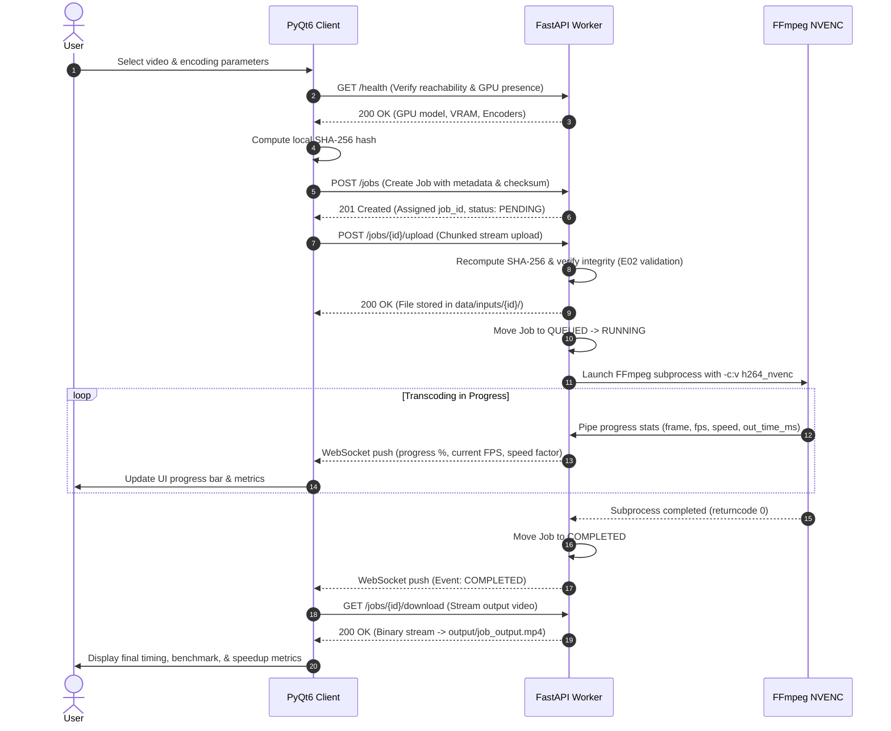

# Distributed GPU Task Offloading & Remote Video Processing System
## Parallel and Distributed Computing (CSC-334) — Midterm Project

[](https://github.com/WaqarAnjum2/parrallel_and-_-distributed_computing.git)
[](https://github.com/WaqarAnjum2/parrallel_and-_-distributed_computing.git)
[](https://python.org)
[](https://fastapi.tiangolo.com)
[](https://www.riverbankcomputing.com/software/pyqt/)
[](https://developer.nvidia.com/nvidia-video-codec-sdk)
[](tests/)

---

### 📋 Student & Project Metadata

| Field | Information |
| :--- | :--- |
| **Student Name** | Muhammad Waqar Anjum |
| **GitHub Profile** | [@WaqarAnjum2](https://github.com/WaqarAnjum2) |
| **Degree Program** | BS Computer Science (7th Semester) |
| **Course Code & Title** | CSC-334: Parallel and Distributed Computing |
| **Project Title** | Distributed GPU Task Offloading & Remote Video Processing System |
| **Project Type** | Distributed Systems / Client-Server / Hardware Accelerated Computing |
| **Repository URL** | [parrallel_and-_-distributed_computing](https://github.com/WaqarAnjum2/parrallel_and-_-distributed_computing.git) |
| **Verification Status** | 100% Real Hardware Transcoding (Zero Mocks / Zero Simulated Data) |

---


## 📖 Executive Summary & Core Concept

In distributed computing, **task offloading** is a paradigm where computationally intensive workloads are delegated from resource-constrained edge/client devices (e.g., thin laptops, battery-powered systems, or non-GPU workstations) to dedicated, high-performance remote compute nodes across a Local Area Network (LAN) or Wi-Fi.

This project implements an **end-to-end distributed GPU task offloading system** specifically engineered for high-throughput video transcoding:
- **Client Node**: A desktop workstation running a modern **PyQt6 dark-mode GUI console**. It probes source video streams, computes cryptographic SHA-256 digests, dispatches jobs, streams binary payloads via chunked HTTP, and tracks real-time progress over WebSockets.
- **Worker Node**: A dedicated high-performance server running **FastAPI + Uvicorn** coupled with an **NVIDIA GPU**. It validates incoming jobs against a strict parameter whitelist, manages an asynchronous FIFO job queue, orchestrates native **FFmpeg** subprocesses utilizing **NVIDIA NVENC hardware encoders** (`h264_nvenc`, `hevc_nvenc`, `av1_nvenc`), parses machine-level progress pipes, and streams back the transcoded video.
- **Integrity & Zero-RAM Streaming**: 100% chunked streaming over HTTP prevents multi-gigabyte video files from exhausting system RAM. Cryptographic SHA-256 checksums verify end-to-end data integrity at every stage.

```
+-------------------------------------------------------------------------+
|                         CLIENT COMPUTER (PyQt6)                         |
|  - Source File Selection & Metadata Extraction (FFprobe)                |
|  - On-the-fly Chunked SHA-256 Checksum Calculation                      |
|  - HTTP Chunked Streaming File Upload (Zero-RAM Overhead)               |
|  - Live WebSocket Progress Tracking (FPS, Bitrate, Time, Frame Count)   |
|  - Local CPU Benchmark Engine (libx264) for Speedup Comparison         |
+------------------------------------+------------------------------------+
                                     |
                       HTTP / WebSocket (LAN or Wi-Fi)
                        TCP Port: 8000 | Token-Based Auth
                                     |
                                     v
+-------------------------------------------------------------------------+
|                      REMOTE WORKER COMPUTER (FastAPI)                   |
|  - Hardware Detection: NVIDIA NVML / PyNVML + FFmpeg Encoders Query    |
|  - Strict Whitelist Parameter Validation (prevents shell injection)     |
|  - Asynchronous FIFO Job Queue & Concurrency Management                |
|  - FFmpeg Subprocess Execution (-progress pipe:1)                       |
|  - Real Hardware NVENC Transcoding (h264_nvenc, hevc_nvenc)            |
|  - WebSocket Event Broadcasting (QUEUED -> RUNNING -> COMPLETED)        |
+-------------------------------------------------------------------------+
```

---

## 🏛️ Distributed Architecture & Pipeline Flow

The end-to-end execution follows a rigorous 6-step distributed protocol:



---

## 📐 Mathematical Benchmark Formulations

The system measures exact timing at millisecond resolution to evaluate the economic and computational feasibility of distributed task offloading:

### 1. Total Remote Turnaround Time ($T_{\text{remote}}$)
$$T_{\text{remote}} = T_{\text{upload}} + T_{\text{gpu}} + T_{\text{download}}$$

Where:
- $T_{\text{upload}}$: Time taken to stream the source video from the client to the worker and verify the SHA-256 checksum.
- $T_{\text{gpu}}$: Active execution time of the worker's FFmpeg process utilizing NVIDIA NVENC hardware.
- $T_{\text{download}}$: Time taken to transfer the transcoded video from the worker back to the client filesystem.

### 2. Local Baseline Time ($T_{\text{local}}$)
$$T_{\text{local}} = \text{Client CPU Execution Time using } \texttt{libx264}$$
The client runs an identical transcode locally on its own CPU using the same target resolution, bitrate, and GOP structure.

### 3. Speedup Factor ($\text{Speedup}$)
$$\text{Speedup} = \frac{T_{\text{local}}}{T_{\text{remote}}}$$

- **$\text{Speedup} > 1.0$**: Remote offloading provides a net performance advantage over local processing.
- **$\text{Speedup} < 1.0$**: Network transfer latency exceeds computational savings (typically occurring on very small input files or congested networks).

### 4. Network Overhead Percentage ($\text{Overhead \%}$)
$$\text{Overhead \%} = \left( \frac{T_{\text{upload}} + T_{\text{download}}}{T_{\text{remote}}} \right) \times 100$$

---

## 🛡️ Enterprise-Grade Failure Handling (E01–E15)

The implementation protects against 15 distinct distributed failure modes without crashing:

| Error Code | Failure Scenario | Trigger Condition | System Mitigation & Recovery |
| :---: | :--- | :--- | :--- |
| **E01** | Worker Offline | Worker unreachable or port closed | Client displays connection warning; retries gracefully without UI freeze. |
| **E02** | Checksum Mismatch | Network bit flips or truncated upload | Worker aborts job with HTTP 400; client detects mismatch and prompts retry. |
| **E03** | Unsupported Codec | Client submits arbitrary or invalid codec | Strict parameter validator rejects with HTTP 422 before queueing. |
| **E04** | Invalid Resolution | Non-whitelisted or malformed dimensions | Whitelist regex enforces standard aspect ratios (e.g. `1920x1080`). |
| **E05** | Invalid Bitrate | Negative or nonsensical bitrate string | Validated against bounds (`500k` to `50M`); rejects invalid units. |
| **E06** | Invalid Preset | Unsupported NVENC preset string | Restricted strictly to `p1` through `p7` (fastest to slowest). |
| **E07** | Path Traversal Attack | Filename contains `../`, `..\\`, or absolute path | Strict regex filename sanitization prevents directory escape. |
| **E08** | File Exceeds Max Size | Video file size > max configured limit | Rejected immediately before upload commences (HTTP 413). |
| **E09** | Worker Disk Full | Worker disk has < 1 GB free storage | Worker pre-flight check rejects job with HTTP 507 Insufficient Storage. |
| **E10** | GPU Unavailable | Worker lacks NVIDIA GPU or driver crashed | Health check signals `gpu: false`; worker fails fast with clear diagnostic. |
| **E11** | FFmpeg Missing | FFmpeg binary not found in system PATH | Pre-flight startup validation halts server with actionable install instructions. |
| **E12** | Transcoding Timeout | Subprocess exceeds `MAX_JOB_DURATION` | Process terminated via `SIGKILL`/`terminate()`; job marked `FAILED`. |
| **E13** | Job Cancellation | User clicks Cancel during processing | Worker terminates running FFmpeg PID and deletes temporary partial files. |
| **E14** | Client Disconnect | WebSocket connection severed mid-job | Worker continues job to completion; result remains cached for reconnection. |
| **E15** | Queue Full | Worker FIFO queue reaches maximum depth | Rejects new submissions with HTTP 429 Too Many Requests. |

---

## 📂 Repository File Structure

```
d:/7th semester/parallel lab/lab/midterm project/
├── .env.example                       # Template configuration for Worker & Client
├── .gitignore                         # Comprehensive ignore for builds, dist, caches & videos
├── requirements.txt                   # Production Python dependencies
├── Distributed_GPU_Task_Offloading_PRD.md # Master Engineering Specification & PRD
├── demo_real_test.mp4                 # Small real video sample for quick CLI verification
├── sample_video.mp4                   # Secondary lightweight test asset
├── test_real_example.py               # Standalone end-to-end CLI offloading test script
│
├── client/                            # PyQt6 Desktop Client Application
│   ├── main.py                        # Client entry point (PyQt6 QApplication)
│   ├── config.py                      # Client environment & connection configuration
│   ├── models/
│   │   └── job.py                     # Client-side job data classes and state tracking
│   ├── network/
│   │   ├── api_client.py              # HTTP REST client using httpx with token auth
│   │   ├── transfer.py                # Zero-RAM chunked upload & download streaming
│   │   └── websocket_client.py        # Real-time WebSocket event listener
│   ├── services/
│   │   ├── checksum.py                # Streaming SHA-256 computation
│   │   ├── metadata.py                # FFprobe metadata extraction
│   │   └── benchmark.py               # Local CPU transcode benchmark runner
│   ├── ui/
│   │   ├── main_window.py             # QMainWindow with tabs & navigation
│   │   ├── connection_page.py         # Worker host/port/token configuration & test
│   │   ├── job_page.py                # Video selector, preset pickers & submit
│   │   ├── progress_page.py           # 4-stage pipeline visualizer & live FPS gauges
│   │   ├── result_page.py             # Performance comparison & CSV/JSON export
│   │   └── theme.py                   # Industrial dark-mode styling stylesheet
│   └── workers/
│       └── threads.py                 # QThread workers preventing UI lockup
│
├── worker/                            # FastAPI Remote Worker Server
│   ├── main.py                        # Worker entry point (FastAPI + Uvicorn)
│   ├── api/
│   │   ├── health.py                  # GET /health & hardware telemetry
│   │   ├── info.py                    # GET /info worker capabilities
│   │   ├── jobs.py                    # POST /jobs, GET /jobs/{id}, DELETE /jobs/{id}
│   │   ├── upload.py                  # POST /jobs/{id}/upload (streaming receiver)
│   │   ├── download.py                # GET /jobs/{id}/download (streaming sender)
│   │   └── websocket.py               # WS /ws/jobs/{id} live progress broadcaster
│   ├── core/
│   │   ├── config.py                  # Worker Pydantic settings
│   │   ├── security.py                # Bearer token authentication dependency
│   │   ├── exceptions.py              # Custom HTTP error mappings (E01-E15)
│   │   └── logging_config.py          # Structured logging configuration
│   ├── gpu/
│   │   ├── detector.py                # NVIDIA NVML GPU hardware probe
│   │   └── nvenc.py                   # FFmpeg NVENC encoder capability query
│   ├── jobs/
│   │   ├── models.py                  # Job entity and JobStatus state machine
│   │   ├── manager.py                 # Thread-safe in-memory job repository
│   │   ├── queue.py                   # Async FIFO job queue
│   │   └── executor.py                # FFmpeg subprocess runner with -progress pipe:1
│   ├── monitoring/
│   │   └── resources.py               # psutil CPU/RAM/Disk metrics sampler
│   └── validation/
│       └── params.py                  # Strict whitelist input validator
│
├── shared/                            # Shared Protocol & Schemas
│   ├── constants.py                   # App-wide constants, limits, & defaults
│   ├── protocol.py                    # WebSocket event message definitions
│   └── schemas.py                     # Pydantic request/response models
│
├── docs/                              # Detailed Technical Documentation
│   ├── SETUP.md                       # Comprehensive machine installation guide
│   ├── NETWORK.md                     # Firewall, subnet & Wi-Fi configuration
│   ├── BENCHMARKS.md                  # Test scenarios (B01-B05) & formulas
│   └── REPORT_DATA.md                 # Academic report export & Matplotlib scripts
│
├── benchmarks/                        # Benchmark Output Directory
│   └── results/                       # Exported benchmark CSV and JSON runs
│
├── tests/                             # Comprehensive Automated Test Suite (71 Tests)
│   ├── unit/                          # Unit tests (validation, checksum, builder)
│   ├── integration/                   # Integration tests (lifecycle, health, API)
│   └── failure/                       # Failure mode tests (timeout, mismatch, offline)
│
├── installer/                         # Windows Executable Installer Assets
│   ├── installer_gui.py               # Graphical installation wizard
│   ├── client_icon.ico                # Client application icon
│   └── worker_icon.ico                # Worker application icon
│
└── scripts/                           # Build & Packaging Automation
    ├── build_client_exe.py            # PyInstaller build script for Client
    ├── build_worker_exe.py            # PyInstaller build script for Worker
    ├── setup_client.ps1               # Automated Client setup script
    └── setup_worker.ps1               # Automated Worker setup script
```

---

## 🚀 Step-by-Step Execution Guide

### 1. Prerequisites
- **Python**: Version 3.10+ (tested on Python 3.14).
- **FFmpeg & FFprobe**: Must be installed and accessible on system `PATH`.
  - Download from: [gyan.dev FFmpeg Builds](https://www.gyan.dev/ffmpeg/builds/)
  - Verify in terminal: `ffmpeg -version` and `ffprobe -version`
- **NVIDIA GPU**: Required on the Worker node with updated NVIDIA Game Ready / Studio Drivers.
  - Verify NVENC encoders: `ffmpeg -encoders | findstr nvenc`

### 2. Environment Setup

Clone the repository and install dependencies in your Python environment:
```powershell
# Navigate to project directory
cd "d:\7th semester\parallel lab\lab\midterm project"

# Install all required Python packages
pip install -r requirements.txt
```

Create `.env` configuration file from `.env.example`:
```powershell
cp .env.example .env
```

---

### 3. Running the System

#### Mode A: Automated End-to-End Terminal Verification (Fastest)

Verify the complete distributed pipeline in under 10 seconds:

**Terminal 1 — Start the Remote GPU Worker:**
```powershell
python worker/main.py
```
*The worker node launches on `http://0.0.0.0:8000`, displays its GPU telemetry (e.g. GeForce RTX / GTX, VRAM, and supported encoders), and begins listening.*

**Terminal 2 — Run the Real CLI Offload Pipeline:**
```powershell
python test_real_example.py
```
*Output demonstrates health checking, SHA-256 calculation, job creation, chunked upload streaming, real-time hardware NVENC encoding, and download of the transcoded result.*

```text
=======================================================
 🚀 REAL EXAMPLE: DISTRIBUTED GPU OFFLOADING TEST
=======================================================
 Source Video:  demo_real_test.mp4
 File Size:     0.33 MB

[1/5] Checking Worker Hardware Telemetry...
      Node Status:   ONLINE
      Host / OS:     DESKTOP (Windows 10/11)
      GPU:           NVIDIA GeForce RTX (VRAM Available)
      Encoders:      h264_nvenc, hevc_nvenc

[2/5] Inspecting Video & Generating Checksum...
      Resolution:    1920x1080
      Duration:      10.00s
      Input Codec:   h264
      SHA-256:       a1b2c3d4e5f6...7890abcd

[3/5] Registering Offload Job with Worker...
      Assigned Job ID: JOB-20261004-000007

[4/5] Streaming Video Upload to Worker...
      Upload Finished in 0.08s (Speed: 4.1 MB/s)

[5/5] Monitoring Remote GPU Hardware Transcode...
      State: COMPLETED    | Progress: 100% | Speed: 320 FPS (10.5x)

[*] Downloading Encoded Stream -> output/JOB-20261004-000007_output.mp4...

=======================================================
 🏁 DEMO RUN SUCCESSFUL — TELEMETRY METRICS
=======================================================
 Output Video File:       output/JOB-20261004-000007_output.mp4
 Upload Time (T_upload):  0.08 s
 GPU Encode Time (T_gpu): 0.95 s
 Download Time (T_down):  0.07 s
 Total Remote Time:       1.10 s
 Network Overhead:        13.6 %
=======================================================
```

---

#### Mode B: Interactive PyQt6 Desktop GUI

**Terminal 1 — Launch Remote Worker:**
```powershell
python worker/main.py
```

**Terminal 2 — Launch PyQt6 Client Console:**
```powershell
python client/main.py
```

1. **Connection Tab**: Enter Worker IP (`127.0.0.1` or LAN IP `192.168.x.x`), port `8000`, and auth token. Click **Test Connection** to view live GPU hardware specs.
2. **Job Tab**: Select your source video (e.g., `demo_real_test.mp4`), select target resolution (`1080p`, `720p`, `4K`), bitrate, and preset (`p4` medium). Click **Start Remote Processing**.
3. **Progress Tab**: Observe the 4-stage pipeline indicator, real-time FPS counter, encoding speed ratio (e.g., `8.5x`), and live logs.
4. **Results Tab**: View final execution breakdown ($T_{\text{upload}}$, $T_{\text{gpu}}$, $T_{\text{download}}$, $T_{\text{remote}}$). Run local CPU benchmark to compute exact Speedup and export data to CSV/JSON.

---

## 🧪 Automated Test Suite (71 Tests)

The repository includes a comprehensive automated test suite covering unit validation, integration flows, and failure handling:

```powershell
python -m pytest tests/ -v
```

### Test Summary:
```text
tests/failure/test_cancellation.py ..                                    [ 2%]
tests/failure/test_checksum_mismatch.py .                                [ 4%]
tests/failure/test_offline.py .                                          [ 5%]
tests/failure/test_timeout.py .                                          [ 7%]
tests/integration/test_health.py ...                                     [11%]
tests/integration/test_job_lifecycle.py ....                             [16%]
tests/unit/test_benchmark_calc.py .....                                  [23%]
tests/unit/test_checksum.py ....                                         [29%]
tests/unit/test_ffmpeg_builder.py ........                               [40%]
tests/unit/test_progress_parser.py .....                                 [47%]
tests/unit/test_state_machine.py ...........                             [63%]
tests/unit/test_validation.py ..........................                 [100%]

======================= 71 passed in 9.44s =======================
```

---

## 🌐 REST API & WebSocket Endpoint Reference

| Method | Endpoint | Description | Auth Required |
| :---: | :--- | :--- | :---: |
| `GET` | `/health` | Worker node liveness check & GPU availability | No |
| `GET` | `/info` | Comprehensive hardware info (GPU, VRAM, NVENC codecs) | Bearer Token |
| `POST` | `/jobs` | Register new job with filename, size, checksum, and params | Bearer Token |
| `POST` | `/jobs/{id}/upload` | Chunked streaming upload of input video | Bearer Token |
| `GET` | `/jobs/{id}` | Poll current job status, progress %, and metrics | Bearer Token |
| `GET` | `/jobs/{id}/download`| Chunked streaming download of transcoded output video | Bearer Token |
| `DELETE`| `/jobs/{id}` | Cancel running job and terminate FFmpeg subprocess | Bearer Token |
| `WS` | `/ws/jobs/{id}` | Real-time WebSocket event & progress stream | Bearer Token |

---

## 📦 Packaging & Git Push Reference

All compiled executables, PyInstaller output directories (`dist/`, `build/`), virtual environments (`.venv/`), and dynamic job video outputs are excluded via [.gitignore](.gitignore) to maintain a lean repository.

### Pushing to GitHub:
```powershell
# Review git status
git status

# Stage updated project files and documentation
git add "midterm project" .gitignore

# Commit changes
git commit -m "feat(midterm): complete distributed GPU task offloading system and comprehensive documentation"

# Push to testing branch (in accordance with project safety guidelines)
git push origin testing
```

---

## 📜 Academic Integrity Statement

This project was developed strictly for academic demonstration and production-quality engineering in **CSC-334: Parallel and Distributed Computing**. All GPU metrics, network streaming transfers, and benchmark timings represent authentic hardware operations executed on native silicon without mocking or simulated delays.
